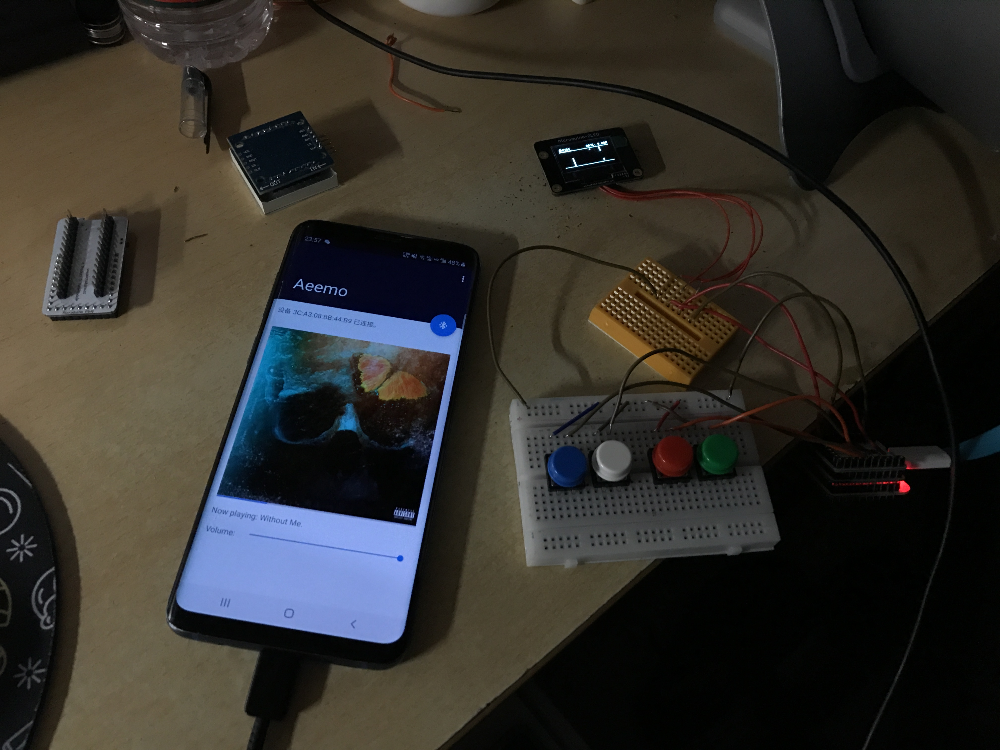

# Aeemo

A Microduino music game.

## From this project you can learn:

- The connection of a Microduino device.
- Display information on Microduino-OLED Module with U8g2lib
- The logic of a standard music game.
- Recieve data from Bluetooth Low Energy (BLE) device such as Microduino. Also the basic connection process of it.

## File demonstration

### ./AndroidClient

Android client. Used to play songs.

### ./SongCreator

A python script with pygame, used to writing new songs.
- Note that the song sample should be no more than 700, or the storage of Microduino would run out.

### ./Aeemo.ino

Main project file.

### ./SongData.h

Song data generated by SongCreator. 10 samples per sec.

## About

Developed By Bill Chen, 2019.8

As the homework project for class 「创客实践」, East China Normal University.
